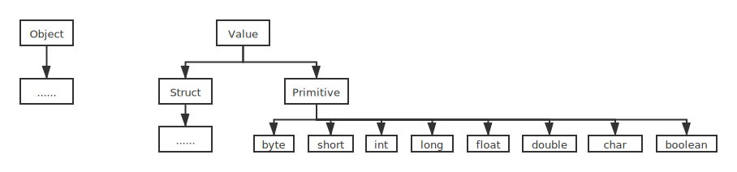

# 2.3 struct类型设计

## 2.3.1 struct类型设计的缺失

java有9中primitive类型，byte,short,int,long,float,double,char,boolean,void.

其中void是否为primitive类型似乎存在争议，一些人一直坚称void并非primitive类型。但是至少void.class.isPrimitive\(\)的值是true的，所以个人认为没理由不算的。

（虽然isPrimitive\(\)函数的javadoc里写的其实很暧昧。。。the eight primitive types and void啥的。。。如果不算，那么void.class.isPrimitive\(\)就该是false；如果算，那么这个文档写成这样是啥意思。。。不管了，估计又是一大坨历史原因之类的东西，总之他们日常操作，你习惯就好）

抛去有争议的void的话，剩余的8种各自代表了一种value。

但是，Java不允许用户自定义新的value type。（一般这个东西在别的语言里被称为struct）

但是在实际使用中很多时候我们其实是需要struct的，尤其是需要高性能的时候。

## 2.3.2 解决方案

按照我的观点的话，事情应该这么搞

首先在这方面我是支持Java的包装类和primitive类分离的，这个比C\#的那套符合逻辑得多。

如果要加Struct的话按照我上面那个图的逻辑塞进去就是了，唯一的问题是可能得给已有的primitive type都安几个爹，不过问题不大。

如图所示，Value与Object为平等关系，而Object为对象，因此Value类的所有子类均不为对象，而是值。

然后，Value的子类Struct的子类代表用户自定义的Struct值类。

Struct值类的每一个field必须也为Value，而不能为Object。

Struct允许有函数（这方面可以学习C++的struct，本质上就是语法糖）。

对每一个Struct类的子类，编译器将自动生成一个对应的Object类的子类，为其包装类。

这样的话是在我看来最理想的给Java的语法插入struct的方式（此书不考虑实现）。

